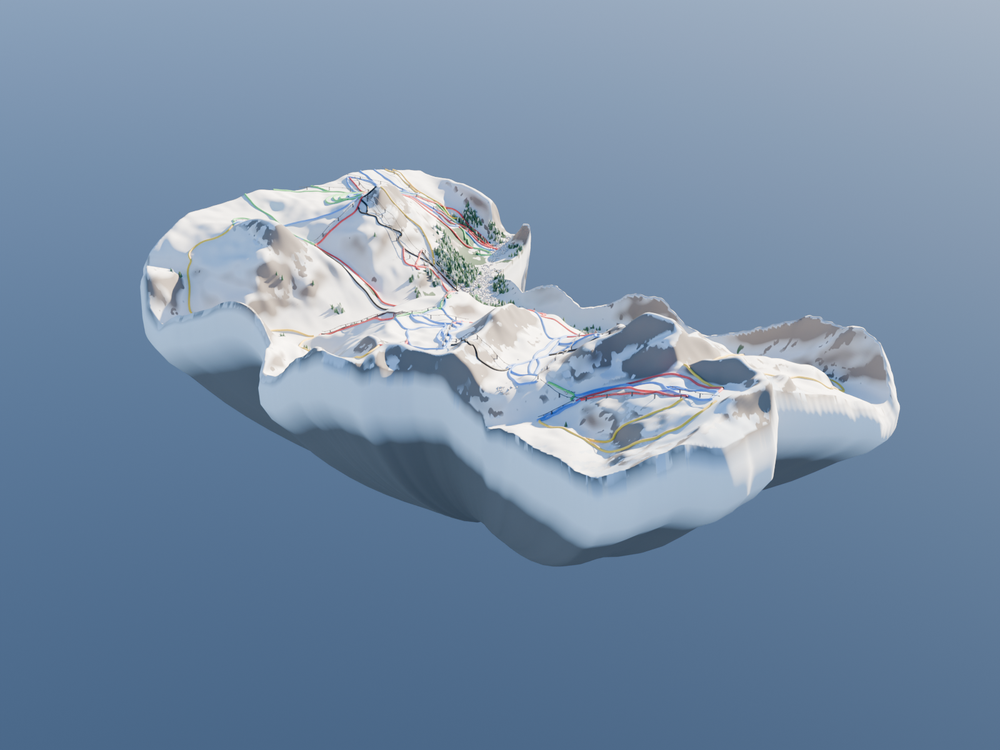
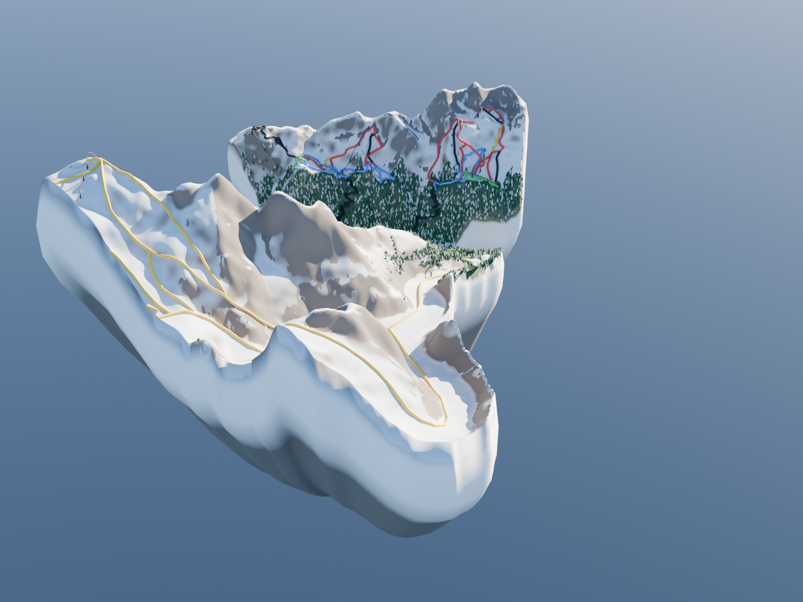

# Carve Canvas

Turns real-world ski resorts into stylised floating 3D dioramas.
See `Project_Vision_Stylised_Ski_Resorts.md` for the vision.

| Val d'Isère | Chamonix |
|---|---|
|  |  |

Everything is generated from open data: Copernicus DEM terrain,
OpenStreetMap pistes/lifts (real difficulty colours), ESA WorldCover
forests/rock/glaciers/villages — then stylised into a floating island
with a snow lip, scattered pines, chalets and chairlifts.

## Pipeline

Each resort is defined by a small config in `resorts/<slug>.toml`
(bounding box + style parameters). Three stages:

```bash
# 1. Download Copernicus GLO-30 DEM tiles, merge + crop to the resort bbox
.venv/bin/python pipeline/fetch_dem.py resorts/val-disere.toml

# 2. Reproject to UTM (metres), resample to a clean heightmap grid
.venv/bin/python pipeline/make_heightmap.py resorts/val-disere.toml

# 3. Fetch pistes + lifts from OpenStreetMap (Overpass API)
.venv/bin/python pipeline/fetch_osm.py resorts/val-disere.toml

# 4. Auto-derive the floating-world boundary from the ski infrastructure
.venv/bin/python pipeline/make_boundary.py resorts/val-disere.toml

# 5. Stream ESA WorldCover land-cover masks (forest/rock/glacier/built)
.venv/bin/python pipeline/fetch_landcover.py resorts/val-disere.toml

# 6. Project pistes + lifts onto the heightmap grid
.venv/bin/python pipeline/make_features.py resorts/val-disere.toml

# 7. Stylise: de-noise, emphasise major forms, deepen valleys
.venv/bin/python pipeline/stylise.py resorts/val-disere.toml

# 8. Build the floating terrain block in Blender, save .blend
scripts/blender.sh --background --python blender/build_terrain.py -- resorts/val-disere.toml
```

Output: `output/<slug>.blend` — open it in Blender (any platform) to explore.

Quick preview render without opening the GUI:

```bash
scripts/blender.sh -b output/val-disere.blend -E CYCLES -o //preview_ -f 1
```

## Layout

```
resorts/    per-resort configs (bbox, style knobs)
pipeline/   plain-Python geodata stages (rasterio)
blender/    bpy scripts run inside Blender (headless or GUI)
data/       downloaded DEMs + intermediate heightmaps (gitignored)
output/     .blend files + renders (gitignored)
tools/      local Blender install + extracted syslibs (gitignored)
scripts/    helper wrappers
```

## Setup (new machine)

```bash
python3 -m venv .venv && .venv/bin/pip install rasterio numpy
# plus Blender 4.x/5.x — on this box it lives in tools/, on desktop
# machines install from blender.org
```
