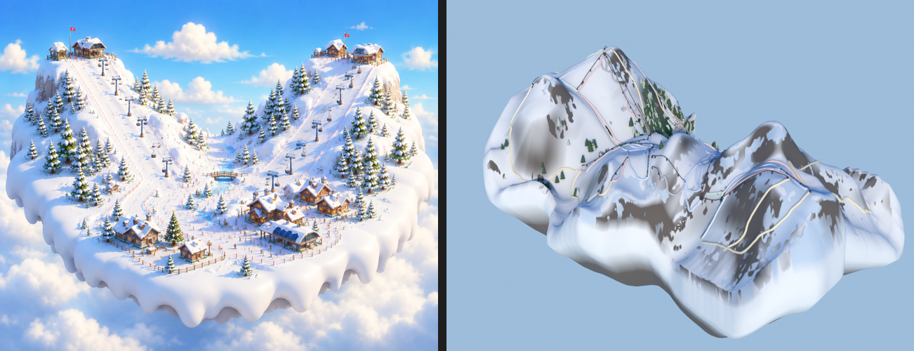

# Gap analysis: current render vs style reference

*Left: reference. Right: current state (2026-07-19).*

## The verdict in one sentence

The reference is an **intimate, densely-detailed vignette** (~1 km of
world, filling the frame, something to look at in every square
centimetre); ours is an **11 km mountain range photographed from a
satellite** — at that content scale, no amount of asset or material
quality can ever read.

## Ranked gaps

### 1. Viewing scale — THE structural gap
The reference frame covers roughly a village and two slopes. Ours
covers the entire Espace Killy. Trees, buildings, lifts — even if they
were perfect art — are sub-pixel specks at this distance. Every other
fix is pointless until the world in frame is ~10x more intimate.
**Fix:** compress the domain into a vignette: village front and centre,
the 2–3 marquee slopes/peaks behind (Bellevarde face, Solaise,
glacier), boring expanses aggressively condensed or dropped. The
boundary becomes tighter and the camera comes close, so objects fill
real screen space.

### 2. Asset quality and density
Reference: sculpted pines with snow caps, timber chalets with deep
eaves, chairlifts with chairs you can count. Ours: cones, boxes.
**Fix (decided):** CC0 stylised asset packs (Kenney / Quaternius /
KayKit class), instanced through our existing real-data placement
masks. Trees first, then buildings, then lift furniture.

### 3. Snow surface language
Reference snow: crisp sculpted drifts and banks, groomed-run corduroy
marks, clean white. Ours: smooth blob with smudgy grey patches that
read as dirt.
**Fix:** kill the rock smudges (rock only on deliberate dramatic peak
faces), piste ribbons become carved grooves with track texture,
sculpted snowbank noise at village/prop scale.

### 4. Sky and atmosphere
Reference: saturated blue, puffy clouds, cloud wisps hugging the island
base, warm sun glow. Ours: flat empty gradient.
**Fix:** cloud puffs (mesh or billboard) around/below the island, sky
with clouds, sun glow. Only matters after 1–3.

### 5. Colour story
Reference: warm accents everywhere — timber browns, roof reds, flag
dots — against cool snow/sky. Ours: monochrome white with grey.
**Fix:** comes mostly free with real assets (2); add flags/poles/props
as deliberate colour accents.

### 6. Island edge
Reference: thick clean white cornice with soft drips. Ours: streaky
grey-white walls.
**Fix:** cornice geometry pass + pure snow material on the full rim.

## Order of work

- **P0 — vignette compression** (structural; everything depends on it)
- **P1 — CC0 asset integration** via existing placement pipeline
- **P2 — snow language** (de-smudge, carved pistes, drift detail)
- **P3 — atmosphere** (clouds, sky, glow, colour accents)

## Process rule (learned the hard way)

Every visual change is judged against THIS document's side-by-side,
re-rendered at the same framing — never against the previous render.
"Better than yesterday" produced weeks of confident drift; "closer to
the left image" is the only metric.
